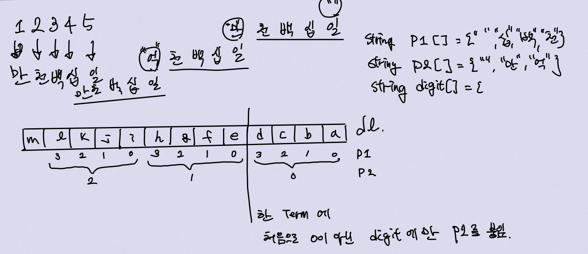

# 숫자를 한글로 변환
https://codeup.kr/problem.php?id=2024

## Solution
말로 하기 귀찮으니 그림그린거 올림
  
- p2배열은 4번마다 갱신되는 단위 ( _, 만, 억, 조, ...)  
- p1배열은 4번마다 반복되는 단위 ( 일, 십, 백, 천)  
- -> for문 두 개를 사용해서 구분 (`isEnd`사용해서 loop탈출)

- p2은 해당 그룹에서 **처음으로 나오는 0이아닌 값**에만 붙음  
    - `flag`를 사용해서 관리 (한 번 붙이면 그 다음엔 안붙게)
- p1은 해당 그룹에서 **digit이 0이 아닌 값**에만 붙음
    - p1의 첫 값을 빈 string으로 해서 '일'은 안붙게 하기
- digit은 **0이 아닌 부분**에만 붙음
    - digit의 첫 값을 빈 string으로 해서 '영'은 안붙게 하기

## Trouble Shooting
한글은 char 세 자리를 차지해서 string reverse함수를 쓸 수 없음  
-> 그냥 vector<string>에 순차적으로 집어넣었음