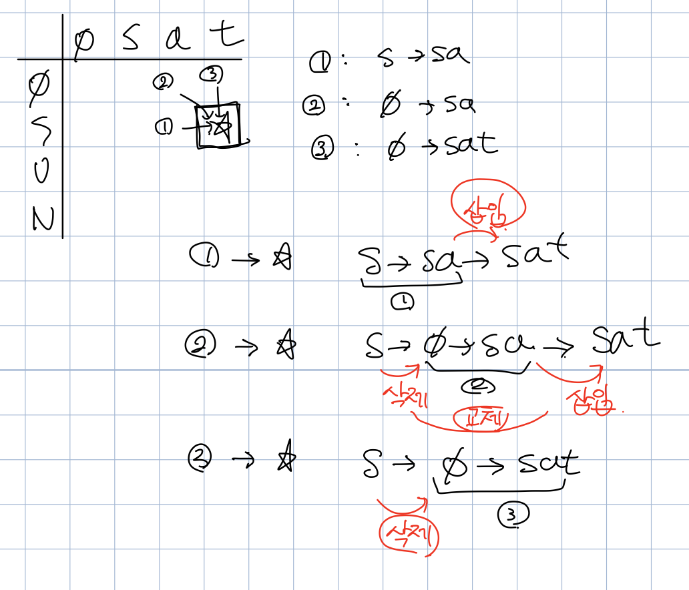

# 편집거리

## Solution - official
dp테이블을 다음과 같이 정의한다
- dp[i][j]의 정의  
    : A[0~i]가 B[0~j]랑 같아지기 위한 최소 연산 횟수
- 점화식
    - 행과 열에 해당하는 문자가 서로 같다면, 왼쪽 위에 해당하는 수를 그대로 대입
        - if(A[i] == B[i]), dp[i][j] = dp[i-1][j-1]
    - 행과 열에 해당하는 문자가 서로 다르다면, **왼쪽(삽입)/위쪽(삭제)/왼쪽 위(교체)**에 해당하는 수 중, 가장 작은 수에 1을 더해서 대입
        - else, dp[i][j] = 1 + min(dp[i][j-1], dp[i-1][j], dp[i-1][j-1])
        -  
- 초기 dp테이블  
    
    - ex  
        - dp[0][8]: A[0]은 빈 문자열 이므로, B[0]부터 B[8]까지(saturday)를 만들기위해선 8번의 연산이 필요하다
        - dp[3][3]: A[0]~A[3](sun)을 B[0]~B[3](sat)으로 만들기 위한 연산 횟수       